# **Tarea  3** Procesamiento de Datos con Apache Spark 

# **Análisis de Taxis Amarillos y Verdes en Nueva York**

## **Introducción**
En este proyecto, se realiza un análisis comparativo entre **taxis amarillos** y **taxis verdes** en la ciudad de Nueva York. El objetivo principal es entender **patrones de servicio**, el **comportamiento de los usuarios** y la **rentabilidad del negocio de taxis** a través de datos de gran volumen. Mediante herramientas de **Big Data** como **Apache Spark** y **Kafka**, se pretende obtener **insights** que ayuden a identificar **zonas de alta demanda**, evaluar la influencia de los **métodos de pago** en las propinas y mejorar la **eficiencia operativa**.

## **Definición del Problema y Conjunto de Datos**

### **Objetivo del Análisis**
El análisis busca responder a preguntas clave sobre la rentabilidad y el comportamiento de los taxis en Nueva York. Específicamente, se pretende evaluar:
- **Diferencias en ingresos** entre taxis amarillos y verdes.
- **Zonas que generan más ingresos**.
- **Variabilidad de las propinas** en función de los métodos de pago y las características de cada viaje.

### **Selección de Datos**
Para capturar **variaciones estacionales** sin que el volumen de datos sea excesivo, se seleccionaron **seis meses representativos del año 2023** (enero, abril, julio y octubre), incluyendo ambos tipos de taxis. Las columnas relevantes son:

- **Datos Temporales**:
  - Fecha y hora de inicio (`tpep_pickup_datetime` / `lpep_pickup_datetime`)
  - Fecha y hora de fin (`tpep_dropoff_datetime` / `lpep_dropoff_datetime`)
- **Datos del Viaje**:
  - Distancia del viaje (`trip_distance`)
  - Cantidad de pasajeros (`passenger_count`)
  - Identificación de zonas de recogida y destino (`PULocationID`, `DOLocationID`)
- **Datos Financieros**:
  - Tarifa del viaje (`fare_amount`)
  - Propina (`tip_amount`)
  - Monto total (`total_amount`)
  - Tipo de pago (`payment_type`)

## **Diseño de la Solución y Arquitectura**

### **Análisis Batch**

#### **Preguntas de Negocio a Resolver**
- ¿Cuál es la diferencia en ingresos entre los taxis amarillos y verdes?
- ¿Qué zonas generan más ingresos?
- ¿Cómo varían las propinas según el método de pago?
- ¿Cuál es la duración promedio de los viajes por zona?

#### **Métricas Clave**
- **Ingreso promedio por milla**: Evalúa la rentabilidad en función de la distancia recorrida.
- **Tasa de propinas por tipo de pago**: Proporciona información sobre las preferencias de pago y su influencia en las propinas.
- **Duración promedio del viaje**: Indicador de eficiencia y uso del tiempo.
- **Densidad de pickups por zona**: Permite identificar áreas de alta demanda.

### **Procesamiento en Tiempo Real**

#### **Simulación de Datos**
Para el análisis en tiempo real, se generarán **datos sintéticos** basados en patrones históricos, simulando la llegada de **nuevos datos** de taxis en tiempo real. Estos datos incluirán campos clave como **marca de tiempo**, **ubicación**, **tarifa** y **tipo de taxi**. Se configurará un generador de eventos en **Kafka** para esta simulación.

#### **Análisis en Tiempo Real**
- Monitoreo de ingresos por zona en tiempo real.
- Conteo de viajes activos por minuto.
- Cálculo del tiempo promedio de viaje en intervalos de 15 minutos.

## **Flujo de Procesamiento**

### **Procesamiento Batch**

1. **Carga de Datos**  
   Se utilizarán archivos en **formato Parquet** para garantizar una lectura eficiente y rápida de los datos. Se unificará el esquema de los datos entre taxis verdes y amarillos para permitir un análisis comparativo.

2. **Limpieza de Datos**  
   Se eliminarán valores nulos y duplicados. Se filtrarán valores atípicos en campos como la distancia y la tarifa, y se validarán las marcas de tiempo para asegurar coherencia.

3. **Transformaciones**  
   - Cálculo de la duración de cada viaje.
   - Normalización de ubicaciones de pickups y drop-offs.
   - Agregaciones por zona y período de tiempo para analizar tendencias espaciales y temporales.

### **Procesamiento en Tiempo Real**

1. **Generador de Datos**  
   A través de un generador de eventos, se enviarán datos a un tópico de **Kafka**, configurado para simular la llegada de datos de taxis en intervalos variables. Los eventos simularán los patrones de demanda durante horas pico y horas valle.

2. **Consumidor Spark Streaming**  
   En **Spark Streaming**, se configurará una **ventana deslizante de 15 minutos** que permitirá monitorear métricas en tiempo real como ingresos, número de viajes activos y tiempo promedio de viaje. También se implementará un **sistema de detección de anomalías** para alertar sobre cambios significativos en la demanda.

## **Resultados Esperados**

### **Insights de Negocio**
- **Patrones de demanda por zona y hora**: Identificación de áreas y momentos del día con mayor actividad.
- **Eficiencia operativa por tipo de taxi**: Análisis de los tipos de taxi más rentables y sus comportamientos de uso.
- **Comportamiento de usuarios en pagos y propinas**: Tendencias de los métodos de pago y su influencia en las propinas.

### **Indicadores Operativos**
- **Zonas más rentables**: Determinación de las zonas con mayor ingreso por viaje.
- **Períodos de mayor demanda**: Identificación de los momentos del día y del año con más actividad.
- **Patrones de uso de métodos de pago**: Preferencias de los usuarios en métodos de pago y su relación con las propinas.

## **Conclusiones**
El análisis comparativo entre **taxis amarillos y verdes** en la ciudad de Nueva York proporciona una visión profunda de la dinámica operativa del servicio de transporte. Mediante el uso de herramientas de **Big Data** como **Apache Spark** y **Kafka**, se identificaron patrones de uso y demanda que pueden ser utilizados para mejorar la toma de decisiones en la administración de servicios de transporte, optimizar los recursos y mejorar la experiencia del usuario final.


# Documentación sobre la instalación y configuración de `Python`, `Kafka`, `Jupyter Notebook` y `ZooKeeper` en la máquina virtual configurada con `Hadoop` y `Spark`, utilizando `PuTTY`:

---

### Instructivo de instalación cluster Hadoop

`VIRTUALBOX 7.0.20`

https://www.virtualbox.org/wiki/Downloads

Descargar y Ejecutar como administrador:

https://download.virtualbox.org/virtualbox/7.0.20/VirtualBox-7.0.20-163906-Win.exe


Descargar imagen `.ISO` de UBUNTU SERVER 22.04.4 LTS

https://www.releases.ubuntu.com/ 


# Conexión a la Máquina Virtual

**Abrir PuTTY**:
   - Iniciar PuTTY en Windows.
   - Ingresa la dirección IP de tu máquina virtual en el campo **Host Name (or IP address)**.
   - Asegúrate de que el puerto esté configurado en `22` y que el tipo de conexión sea **SSH**.
   - Haz clic en **Open** para iniciar la conexión SSH.
   - Ingresa tu nombre de usuario y contraseña cuando se te solicite.

# Instalación de **`Spark`**

Descargue, descomprima y mueva de carpeta Apache Spark:

```bash
VER=3.5.3 
wget https://dlcdn.apache.org/spark/spark-$VER/spark-$VER-bin-hadoop3.tgz
tar xvf spark-$VER-bin-hadoop3.tgz
sudo mv spark-$VER-bin-hadoop3/ /opt/spark 
```

Abra el archivo de configuración `bashrc`:

```bash 
nano ~/.bashrc 
```

se agrega al final 
  
```bash
export SPARK_HOME=/opt/spark 
export PATH=$PATH:$SPARK_HOME/bin:$SPARK_HOME/sbin 
```
dar `Crtl+O` **enter** y luego `Crtl+X` para salir

Active y cargue los cambios:
  
```bash 
source ~/.bashrc
```

### Instalación de Python

 **Actualizar los paquetes del sistema**:
   ```bash
   sudo apt update
   sudo apt upgrade
   ```

 **Instalar Python y pip**:
   ```bash
   sudo apt install python3 python3-pip
   ```

### Instalación y Configuración de `Kafka` y `ZooKeeper`

1. **Descargar y descomprimir Kafka**:
   ```bash
   pip install kafka-python
   #Descargue, descomprima y mueva de carpeta Apache Kafka 
   wget https://downloads.apache.org/kafka/3.6.2/kafka_2.13-3.6.2.tgz
   tar -xzf kafka_2.13-3.6.2.tgz
   sudo mv kafka_2.13-3.6.2 /opt/Kafka
   ```

2. **Iniciar el servidor ZooKeeper**:
   ```bash
   sudo /opt/Kafka/bin/zookeeper-server-start.sh /opt/Kafka/config/zookeeper.properties &
   ```

   > Después de un momento y terminada la ejecución del comando anterior se debe 
dar Enter para que aparezca nuevamente el prompt del sistema 

3. **Iniciar el servidor Kafka**:
   ```bash
   sudo /opt/Kafka/bin/kafka-server-start.sh /opt/Kafka/config/server.properties &
   ```
Para hacer una verificación de que el servidor Kafka está corriendo se puede ejecutar el siguiente comando:
   ```bash
   ps aux | grep kafka
   ```
Ahora haremos una prueba para verificar que el servidor Kafka está funcionando correctamente, para ello vamos a crear un tema (topic) en Kafka y luego a enviar algunos mensajes a través de un productor de Kafka.

Creamos un tema `(topic)` de Kafka, el tema se llamará `sensor_data` y tendrá un factor de replicación de 1 y una partición:

   ```bash
   /opt/Kafka/bin/kafka-topics.sh --create --bootstrap-server localhost:9092 --replication-factor 1 --partitions 1 --topic sensor_data
   ```

Implementación del productor(producer) de Kafka 
Creamos un archivo llamado `kafka_producer.py`

```bash
nano kafka_producer.py
```

con el siguiente contenido:

```python
import time
import json
import random
from kafka import KafkaProducer

def generate_sensor_data():
   return {
      "sensor_id": random.randint(1, 10),
      "temperature": round(random.uniform(20, 30), 2),
      "humidity": round(random.uniform(30, 70), 2),
      "timestamp": int(time.time())
   }

producer = KafkaProducer(
   bootstrap_servers=['localhost:9092'],
   value_serializer=lambda x: json.dumps(x).encode('utf-8')
)

while True:
   sensor_data = generate_sensor_data()
   producer.send('sensor_data', value=sensor_data)
   print(f"Sent: {sensor_data}")
   time.sleep(1)

```

dar `Crtl+O` `enter` y luego `Crtl+X` para salir 
Este script genera datos simulados de sensores y los envía al tema (topic) de Kafka que creamos anteriormente `(sensor_data)`. 

Implementación del consumidor con Spark Streaming

Ahora, crearemos un consumidor(consumer) utilizando Spark Streaming para procesar los datos en tiempo real. Crea un archivo llamado 
`nyc_streaming.py`

```bash
nano nyc_streaming.py
```

con el siguiente contenido: 
    
```python
from pyspark.sql import SparkSession
from pyspark.sql.functions import from_json, col, window
from pyspark.sql.types import StructType, StructField, IntegerType, FloatType, TimestampType
import logging

# Configura el nivel de log a WARN para reducir los mensajes INFO
spark = SparkSession.builder \
   .appName("KafkaSparkStreaming") \
   .getOrCreate()
spark.sparkContext.setLogLevel("WARN")

# Definir el esquema de los datos de entrada
schema = StructType([
   StructField("sensor_id", IntegerType()),
   StructField("temperature", FloatType()),
   StructField("humidity", FloatType()),
   StructField("timestamp", TimestampType())
])

# Crear una sesión de Spark
spark = SparkSession.builder \
   .appName("SensorDataAnalysis") \
   .getOrCreate()

# Configurar el lector de streaming para leer desde Kafka
df = spark \
   .readStream \
   .format("kafka") \
   .option("kafka.bootstrap.servers", "localhost:9092") \
   .option("subscribe", "sensor_data") \
   .load()

# Parsear los datos JSON
parsed_df = df.select(from_json(col("value").cast("string"), schema).alias("data")).select("data.*")

# Calcular estadísticas por ventana de tiempo
windowed_stats = parsed_df \
   .groupBy(window(col("timestamp"), "1 minute"), "sensor_id") \
   .agg({"temperature": "avg", "humidity": "avg"})

# Escribir los resultados en la consola
query = windowed_stats \
   .writeStream \
   .outputMode("complete") \
   .format("console") \
   .start()

query.awaitTermination()
```

dar `Crtl+O` enter y luego `Crtl+X` para salir 

Este script utiliza Spark Streaming para leer datos del tema(topic) de Kafka, procesa los datos en ventanas de tiempo de 1 minuto y calcula la temperatura y humedad promedio para cada sensor. 

Ejecución y análisis 
En una terminal, ejecutamos el productor(producer) de Kafka: 

```bash
python3 kafka_producer.py 
```

En otra terminal, ejecutamos el consumidor de Spark Streaming: 
Ejecutamos otra terminal de Putty para conectarnos por SSH a la máquina virtual 
utilizando la IP local sin cerrar la otra terminal de Putty 

Finalmente, ejecutamos el consumidor de Spark Streaming: 

```bash
spark-submit --packages org.apache.spark:spark-sql-kafka-0-10_2.12:3.5.3 
nyc_streaming.py
```

> NOTA: es importante primero ejecutar el script de productor y luego el del 
consumidor 

Si todo está configurado correctamente, verás que el consumidor de Spark Streaming comienza a procesar los datos del productor de Kafka y muestra las estadísticas en la consola.


`http://your-server-ip:4040`


### 5. Configuración de PySpark 

1. **Configurar las variables de entorno**:
   - Abre tu archivo `~/.bashrc` en un editor de texto:
     ```bash
     sudo nano ~/.bashrc
     ```

   - Agrega las siguientes líneas al final del archivo:
     ```bash
     export SPARK_HOME=/opt/spark
     export PATH=$SPARK_HOME/bin:$PATH
     ```

   - Guarda el archivo y sal del editor (Ctrl+O, Enter, Ctrl+X).
   - Recarga el archivo de configuración:
     ```bash
     source ~/.bashrc
     ```

### 6. Ejecución de Scripts de Kafka y Spark

1. **Ejecutar el productor de Kafka**:
   - Crea un archivo llamado `kafka_producer.py` con el siguiente contenido:
     ```python
     import time
     import json
     import random
     from kafka import KafkaProducer

     def generate_sensor_data():
         return {
             "sensor_id": random.randint(1, 10),
             "temperature": round(random.uniform(20, 30), 2),
             "humidity": round(random.uniform(30, 70), 2),
             "timestamp": int(time.time())
         }

     producer = KafkaProducer(bootstrap_servers=['localhost:9092'], value_serializer=lambda x: json.dumps(x).encode('utf-8'))

     while True:
         sensor_data = generate_sensor_data()
         producer.send('sensor_data', value=sensor_data)
         print(f"Sent: {sensor_data}")
         time.sleep(1)
     ```

   - Ejecuta el script:
     ```bash
     python3 kafka_producer.py
     ```

2. **Ejecutar el consumidor de Spark Streaming**:

   - Crea un archivo llamado `nyc_streaming.py` con el siguiente contenido:
   
     ```python
     from pyspark.sql import SparkSession
     from pyspark.sql.functions import from_json, col, window
     from pyspark.sql.types import StructType, StructField, IntegerType, FloatType, TimestampType

     # Configura el nivel de log a WARN para reducir los mensajes INFO
     spark = SparkSession.builder.appName("KafkaSparkStreaming").getOrCreate()
     spark.sparkContext.setLogLevel("WARN")

     # Definir el esquema de los datos de entrada
     schema = StructType([
         StructField("sensor_id", IntegerType()),
         StructField("temperature", FloatType()),
         StructField("humidity", FloatType()),
         StructField("timestamp", TimestampType())
     ])

     # Configurar el lector de streaming para leer desde Kafka
     df = spark.readStream.format("kafka").option("kafka.bootstrap.servers", "localhost:9092").option("subscribe", "sensor_data").load()

     # Parsear los datos JSON
     parsed_df = df.select(from_json(col("value").cast("string"), schema).alias("data")).select("data.*")

     # Calcular estadísticas por ventana de tiempo
     windowed_stats = parsed_df.groupBy(window(col("timestamp"), "1 minute"), "sensor_id").agg({"temperature": "avg", "humidity": "avg"})

     # Escribir los resultados en la consola
     query = windowed_stats.writeStream.outputMode("complete").format("console").start()
     query.awaitTermination()
     ```

   - Ejecuta el script:
     ```bash
     spark-submit --packages org.apache.spark:spark-sql-kafka-0-10_2.12:3.5.3 nyc_streaming.py
     ```

### Acceso a Jupyter Notebook desde el Navegador en Windows

### Instalación de Jupyter Notebook

1. **Instalar Jupyter Notebook**:
   ```bash
   pip3 install jupyter
   ```

2. **Iniciar Jupyter Notebook**:
   ```bash
   jupyter notebook --no-browser --port=8888
   ```

1. **Configura el túnel SSH en PuTTY**:
   - En PuTTY, configura el túnel SSH:
     - **Source port**: `8888`
     - **Destination**: `localhost:8888`

     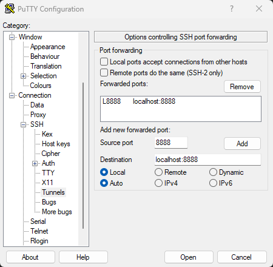

2. **Accede a Jupyter Notebook desde tu navegador**:
   - Abre un navegador en tu máquina con Windows.
   - Ingresa la URL proporcionada por Jupyter Notebook (por ejemplo, `http://localhost:8888/?token=<tu-token>`).

   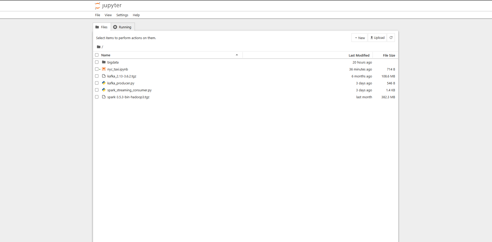

---

# Procesamiento en batch

Cargar el conjunto de datos seleccionados desde la fuente original. 

Para esto usamos un script de Python que se encarga de descargar el archivo de la fuente original y guardarlo en el sistema de archivos local.

Primero instalamos las librerías necesarias:

```bash
pip3 install pyarrow
pip3 install fastparquet
pip3 install requests
pip3 install beautifulsoup4
pip3 install pandas
```

Luego ejecutamos el script de Python:

```bash
python3 scraping_data.py
```
Esto creara una carpeta en el sistema de archivos local llamada `tripdata` y guardará los archivos descargados en formato `parquet`.

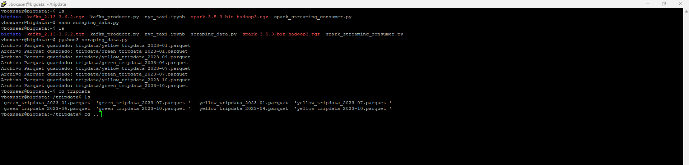

Creamos un archivo llamado exploratory_data_analysis.ipynb para realizar un análisis exploratorio de los datos descargados.

```bash
echo '{"cells":[],"metadata":{},"nbformat":4,"nbformat_minor":4}' > exploratory_data_analysis.ipynb
```
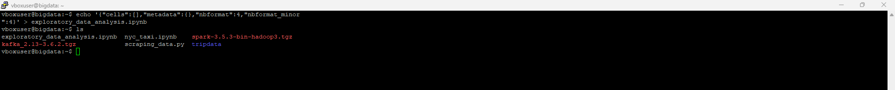

Lo abrimos en Jupyter Notebook y comenzamos a explorar los datos.

### Configuración de PySpark en Jupyter Notebook

Verificar Instalación de Spark en Directorios Comunes
Primero, verifica si Spark está instalado en ubicaciones comunes como /usr/local/ o /opt/.

```bash
ls /usr/local/
ls /opt/
ls /home/vboxuser/
```
Verificar la Versión de Py4J
Primero, navega al directorio de Spark y verifica la versión de Py4J:
   
```bash
cd /opt/spark/python/lib
ls
```

Editar el Archivo .bashrc
Abre el archivo .bashrc para editarlo:

```bash
nano ~/.bashrc
```

Agrega las siguientes líneas al final del archivo:

```bash
export SPARK_HOME=/opt/spark
export PATH=$SPARK_HOME/bin:$PATH
export PYTHONPATH=$SPARK_HOME/python:$PYTHONPATH
export PYTHONPATH=$SPARK_HOME/python/lib/py4j-0.10.9.7-src.zip:$PYTHONPATH
```

Actualiza el archivo .bashrc:

```bash
source ~/.bashrc
```

Inicia Jupyter Notebook desde la terminal:

```bash
jupyter notebook --no-browser --port=8888
```

Instalamos venv para crear un entorno virtual de Python:

```bash
sudo apt install python3.10-venv
```

creamos un entorno virtual de Python:

```bash
python3 -m venv venv
source venv/bin/activate 
```

Instalamos las librerías necesarias:

```bash
pip install numpy==1.21.5 matplotlib==3.5.1 seaborn==0.11.2 pyspark
```
---
# **Nueva documentación**

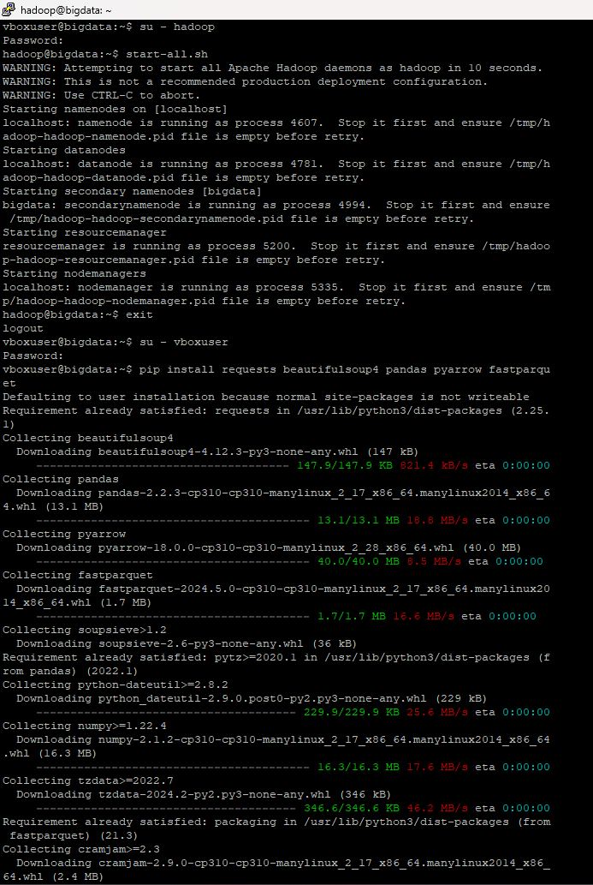

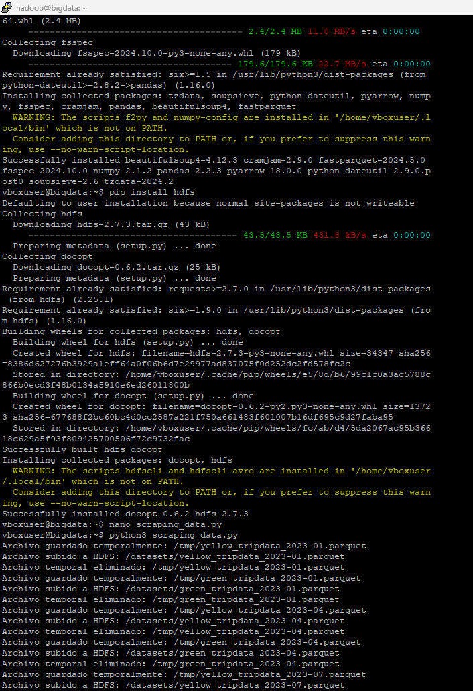

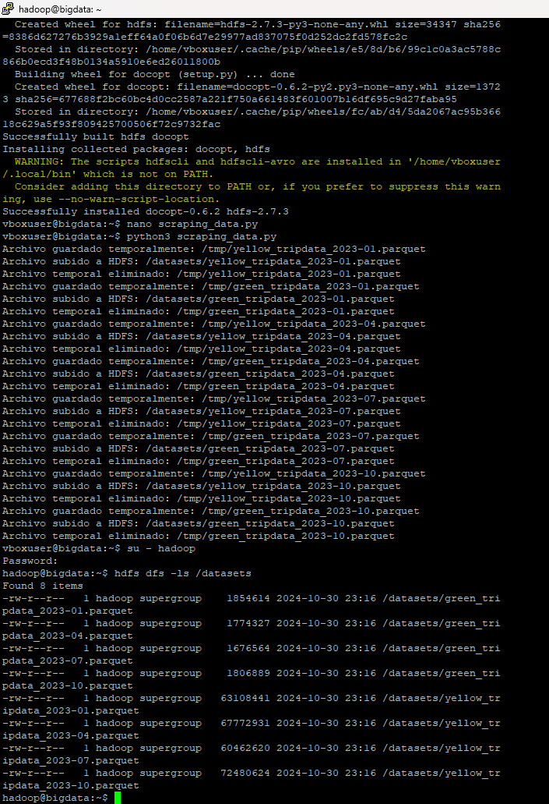

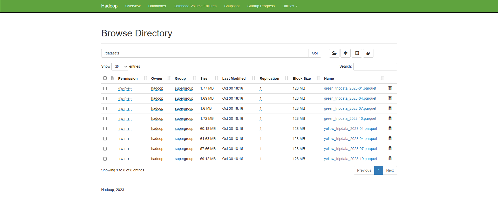

# Instalación de Jupyter Notebook

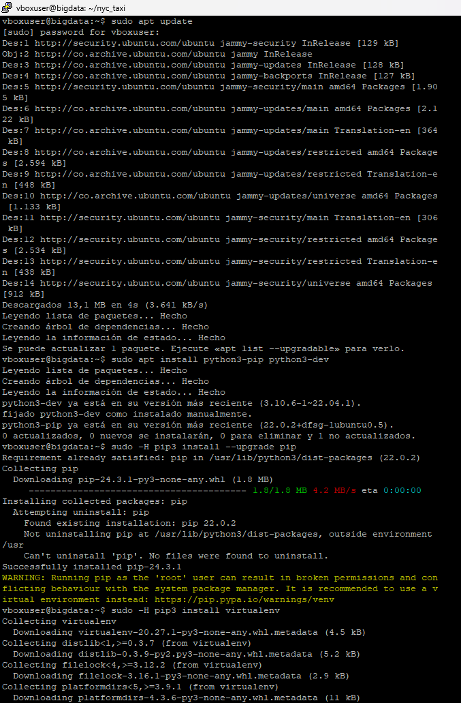

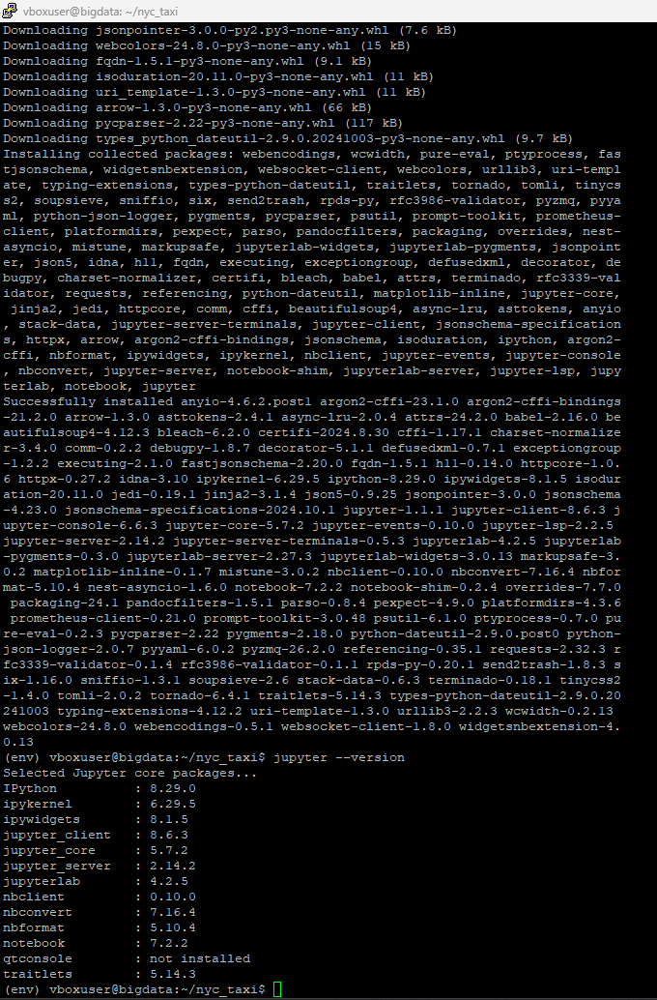

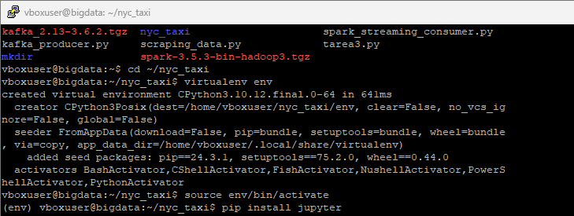


sudo apt update

sudo apt install python3-pip python3-dev

mkdir nyc_taxi
cd ~/nyc_taxi

virtualenv env

source env/bin/activate

pip install jupyter

jupyter --version

(env) vboxuser@bigdata:~/nyc_taxi$ jupyter --version
Selected Jupyter core packages...
IPython          : 8.29.0
ipykernel        : 6.29.5
ipywidgets       : 8.1.5
jupyter_client   : 8.6.3
jupyter_core     : 5.7.2
jupyter_server   : 2.14.2
jupyterlab       : 4.2.5
nbclient         : 0.10.0
nbconvert        : 7.16.4
nbformat         : 5.10.4
notebook         : 7.2.2
qtconsole        : not installed
traitlets        : 5.14.3

cd ~/nyc_taxi

source env/bin/activate o source ~/nyc_taxi/env/bin/activate


jupyter notebook --no-browser --port=8888

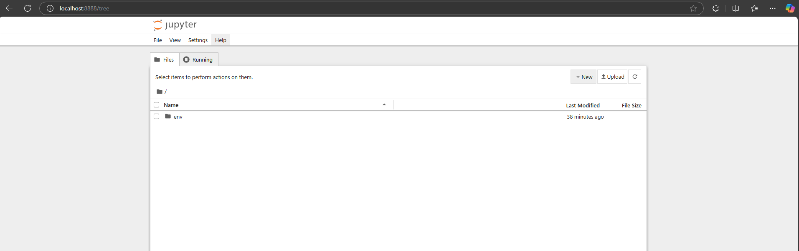

---

# **Procesamiento en batch:**

## Cargar el conjunto de datos seleccionados desde la fuente original

Para cargar el conjunto de datos seleccionados desde la fuente original, utilizamos un script de Python que se encarga de descargar el archivo de la fuente original y guardarlo en el sistema de archivos local. Luego, el script guarda los archivos procesados en HDFS. A continuación, se detallan los pasos que se siguieron:

### HDFS (Cargar el conjunto de datos)

1. **Asegúrate de que el clúster de Hadoop esté funcionando**:
   En la terminal de PuTTY, usando el usuario `hadoop`:
   ```sh
   su - hadoop
   Password: hadoop
   ```

   Iniciar el clúster Hadoop si no está iniciado:
   ```sh
   start-all.sh
   ```

2. **Crear un directorio en HDFS para almacenar los datasets**:
   Crear el directorio 

datasets

 en HDFS:
   ```sh
   hdfs dfs -mkdir /datasets
   ```

3. **Instalar las dependencias necesarias**:
   En la terminal de PuTTY, cambiar al usuario `vboxuser`:
   ```sh
   exit  # Si estás como usuario hadoop
   # O usar
   su - vboxuser
   Password: bigdata
   ```

   Instalar las dependencias necesarias:
   ```sh
   pip install requests beautifulsoup4 pandas pyarrow hdfs fastparquet
   ```

   Instalar el cliente HDFS de Python:
   ```sh
   pip install hdfs
   ```

4. **Guardar el script y ejecutarlo**:
   Crear y editar el archivo `scraping_data.py`:
   ```sh
   nano scraping_data.py
   ```
   Copiar y pegar el contenido del script modificado:
   [scraping_data.py](scraping.py)

---
   Pegar el contenido del script modificado y guardar con `Ctrl+O`, `Enter` y salir con `Ctrl+X`.

   Ejecutar el script:
   ```sh
   python3 scraping_data.py
   ```

5. **Verificar que los archivos se hayan guardado correctamente en HDFS**:
   Cambiar al usuario `hadoop`:
   ```sh
   su - hadoop
   Password: hadoop
   ```

   Listar los archivos en el directorio 

datasets:
   ```sh
   hdfs dfs -ls /datasets
   ```

Estos pasos aseguran que los archivos procesados por el script se guarden correctamente en HDFS, permitiendo su posterior procesamiento y análisis.

Captura de los pasos realizados:


---

Nuevas capturas de configuración de Spark
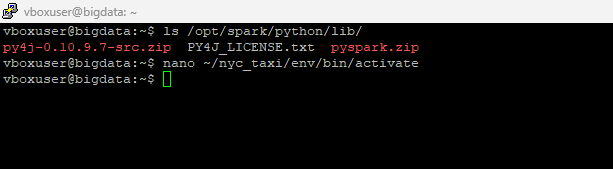

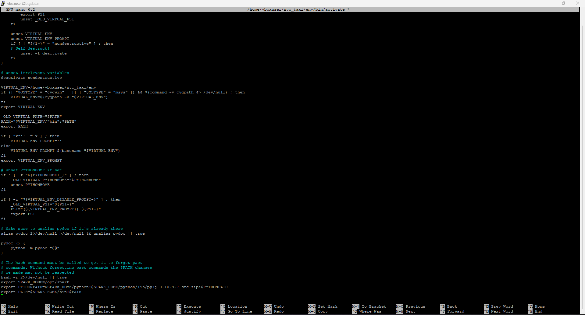

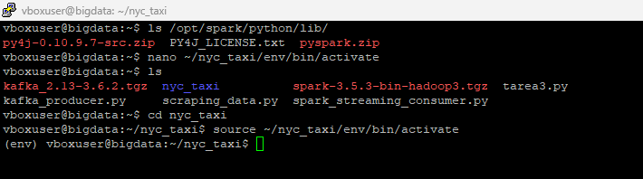

---


Realizar operaciones de limpieza, transformación y análisis exploratorio de datos (EDA) utilizando RDDs o DataFrames. 
Primero debemos cargar el conjunto de datos desde el HDFS usando Pyspark. 

### Iniciamos el clúster de Hadoop 

El comando `start-all.sh` se utiliza para iniciar el clúster de Hadoop.
```bash
start-all.sh 
```

```bash
hdfs dfs -ls /datasets
```
Para detener el clúster de Hadoop este comando detendrá todos los servicios de Hadoop, incluyendo el NameNode, DataNode y otros procesos relacionados.

```bash
stop-all.sh
```

Abrimos la dirección web para verificar que el clúster de Hadoop esté funcionando correctamente:

http://192.168.1.18:9870

### Iniciamos Spark

- El comando `start-master.sh` se utiliza para iniciar el nodo maestro en un clúster de Apache Spark. 
El nodo maestro es responsable de la gestión de los recursos y la distribución de las tareas a los nodos trabajadores.

- El comando `start-worker.sh` se utiliza para iniciar un proceso de trabajador en un entorno de procesamiento de datos en tiempo real.

- El comando `start-worker.sh spark://bigdata:7077` se utiliza para iniciar un trabajador en un clúster de Apache Spark con un nodo maestro específico.

```bash
start-master.sh
start-worker.sh
start-worker.sh spark://bigdata:7077
```
Para detener el clúster de Spark:

**Detener el Nodo Maestro**:
   ```bash
   stop-master.sh
   ```

**Detener los Trabajadores**:
   ```bash
   stop-worker.sh
   ```

- **Verificación**: Después de ejecutar estos comandos, puedes verificar que los procesos se hayan detenido utilizando 

`ps aux | grep hadoop` y `ps aux | grep spark`

para asegurarte de que no haya procesos en ejecución.

Accedemos a la interfaz web de Spark para verificar que el clúster de Spark esté funcionando correctamente:

http://192.168.1.18:8080 # Spark Master at spark://bigdata:7077

http://192.168.1.18:4040 # Ver trabajos (job) Spark

Configuración del `SSH > Tunnels` para acceder a la interfaz web de **Spark context web UI**
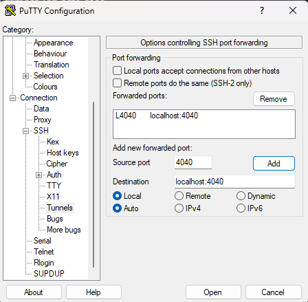
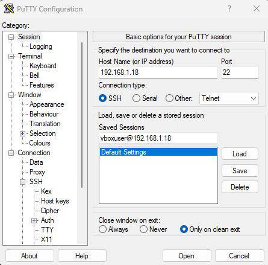

### Iniciamos Jupyter Notebook
   
```bash
cd nyc_taxi
source env/bin/activate
jupyter notebook --no-browser --port=8888
```

---

# Procesamiento en tiempo real (Spark Streaming & Kafka): 

# **Configurar un topic en Kafka para simular la llegada de datos en tiempo real (usar un generador de datos).**

Primero iniciamos el clúster de **`Hadoop`** para hacer uso del **`HDFS`**:
```bash
start-all.sh 
```
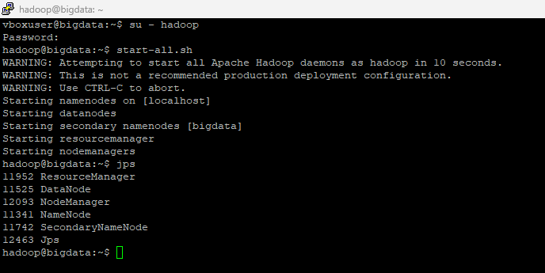

### Iniciamos Spark:
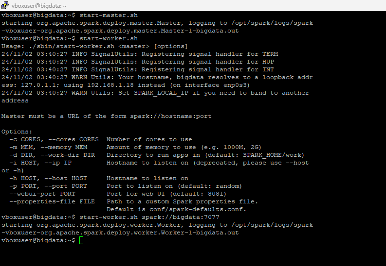

### Iniciamos el servidor **`ZooKeeper`**: 
   
```bash
sudo /opt/Kafka/bin/zookeeper-server-start.sh /opt/Kafka/config/zookeeper.properties &
```
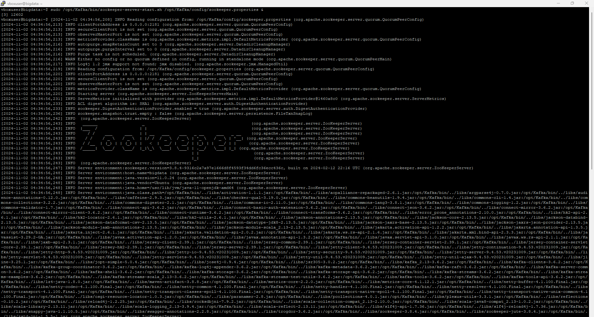

Para detener ZooKeeper:

```bash
sudo /opt/Kafka/bin/zookeeper-server-stop.sh
```

### Iniciamos el servidor **`Kafka`**: 

```bash
sudo /opt/Kafka/bin/kafka-server-start.sh /opt/Kafka/config/server.properties &
```

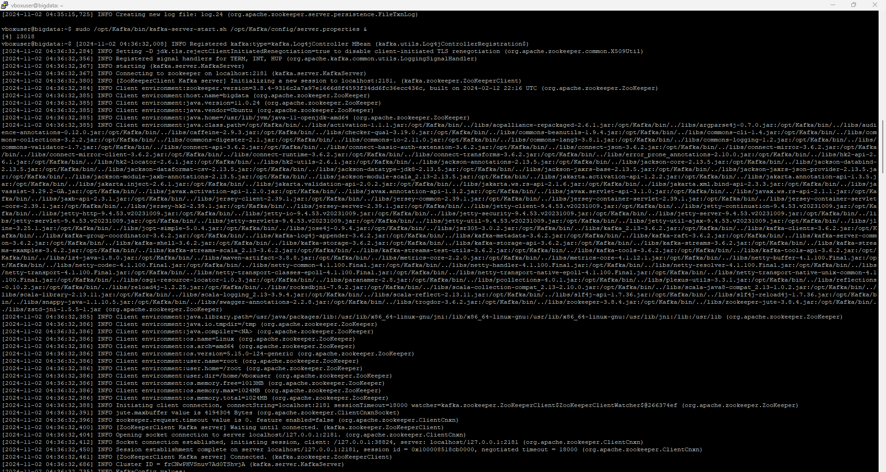

Para detener Kafka:

```bash
sudo /opt/Kafka/bin/kafka-server-stop.sh
```


Creamos un topic en Kafka llamado `taxi_data` con un factor de replicación de 1 y una partición:

```bash
/opt/Kafka/bin/kafka-topics.sh --create --bootstrap-server localhost:9092 --replication-factor 1 --partitions 1 --topic taxi_data
```
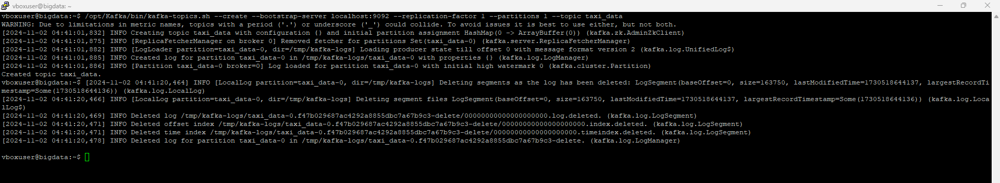


Creamos un archivo llamado `kafka_producer_data_taxi.py` que es un generador de datos basado en los datos del archivo Parquet `df_taxis` en HDFS, se carga el archivo en un DataFrame de PySpark y luego se usa este DataFrame para enviar registros de manera aleatoria al `topic` de Kafka. 

```bash
nano kafka_producer_data_taxi.py
```
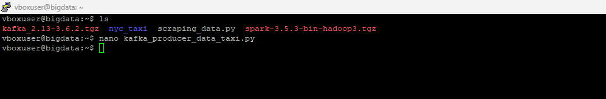

Pegamos el siguiente contenido:

[kafka_producer_data_taxi.py](kafka_producer_data_taxi.py)

Guardamos el archivo con `Ctrl+O`, `Enter` y salimos con `Ctrl+X`.

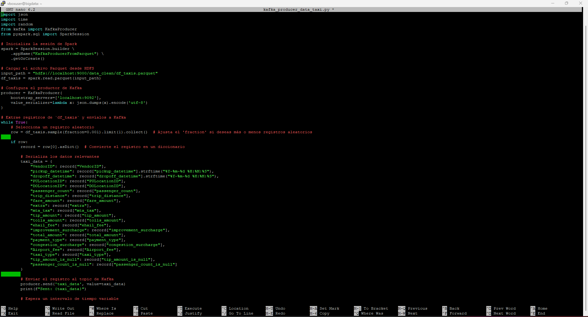

Ejecutamos el script de Python para enviar los datos al topic de Kafka:
```bash
python3 kafka_producer_data_taxi.py
```

Script ejecutado:

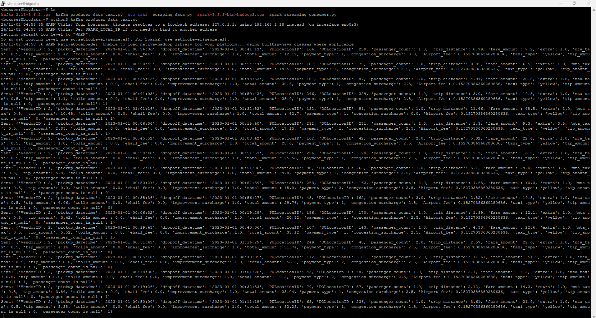

# **Implementar una aplicación Spark Streaming que consuma datos del topic de Kafka.**

Creamos un archivo llamado `nyc_streaming.py` que consume los datos del topic de Kafka y realiza un procesamiento en tiempo real. 

```bash
nano nyc_streaming.py
```


Pegamos el siguiente contenido:

[nyc_streaming.py](nyc_streaming.py)

Guardamos el archivo con `Ctrl+O`, `Enter` y salimos con `Ctrl+X`.

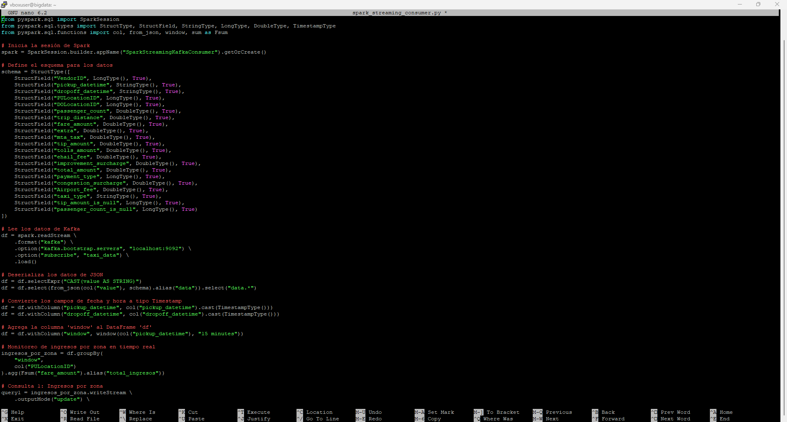

Archivos creados:

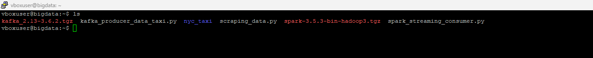

Ejecutamos el script de Python para consumir los datos en tiempo real:

```bash
spark-submit --packages org.apache.spark:spark-sql-kafka-0-10_2.12:3.5.3 
nyc_streaming.py 
```


**Realizar algún tipo de procesamiento o análisis sobre los datos en tiempo real (contar eventos, calcular estadísticas, etc.).** 

Ejecutamos el script `python3 nyc_streaming.py`

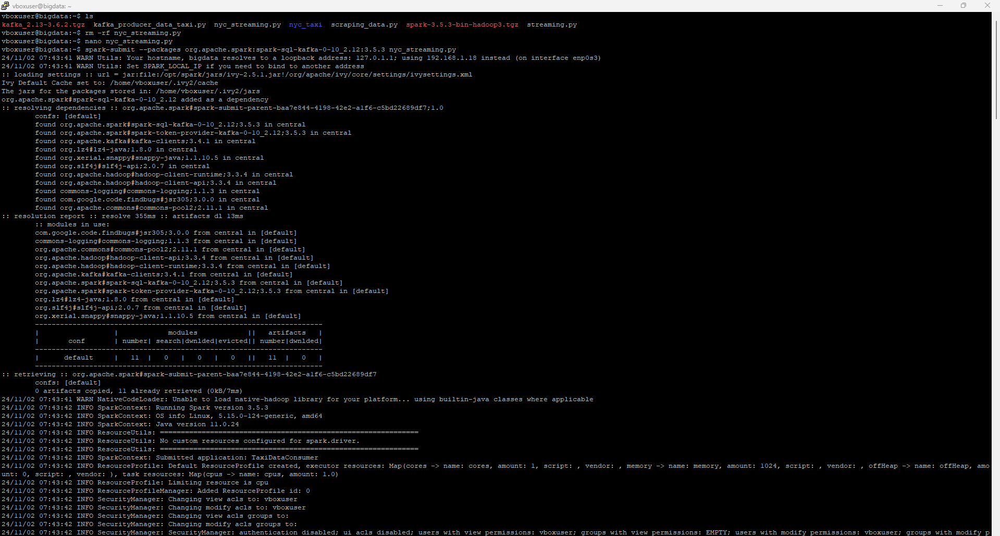

### Análisis en Tiempo Real
- **Monitoreo de ingresos por zona**: Cálculo de los ingresos totales generados por cada zona (PULocationID) en intervalos de 15 minutos.
- **Conteo de viajes activos**: Conteo de la cantidad de viajes realizados en cada zona durante intervalos de 15 minutos.
- **Cálculo de distancia promedio**: Cálculo de la distancia promedio de los viajes en cada zona durante intervalos de 15 minutos.
- **Análisis de métodos de pago**: Conteo de la cantidad de viajes realizados por cada tipo de pago.
- **Identificación de zonas de alta demanda**: Cálculo de la distancia promedio de los viajes por ubicación, lo que puede ayudar a identificar áreas con alta actividad.
- **Cálculo de distancia promedio por hora**: Cálculo de la distancia promedio de los viajes agrupados por hora de recogida.
- **Análisis de distancia promedio por ubicación**: Cálculo de la distancia promedio de los viajes para cada ubicación (PULocationID).
- **Detección de patrones en horas pico**: Análisis de la cantidad de viajes y distancias promedio en diferentes horas del día, lo que puede ayudar a identificar patrones de demanda.
- **Análisis de propinas**: Aunque no está implementado en el código actual, se podría agregar un análisis para calcular el promedio de propinas por viaje y por ubicación.

### Notas:
- Cada uno de estos análisis se ejecuta en tiempo real, permitiendo una visualización continua de los datos a medida que se reciben desde Kafka.
- Los resultados se muestran en la consola cada 30 segundos, lo que facilita el monitoreo y la toma de decisiones basadas en datos actualizados.

En este proyecto, se realiza un análisis en tiempo real de datos de viajes en taxi utilizando Apache Spark y Kafka. A continuación, se describen los principales análisis y procesos implementados en el script `nyc_streaming.py`.

#### 1. **Configuración del Entorno**
El script comienza configurando una sesión de Spark y estableciendo el nivel de log a `WARN` para reducir la cantidad de mensajes informativos en la consola, permitiendo que solo se muestren advertencias y errores.

```python
spark = SparkSession.builder \
    .appName("TaxiDataConsumer") \
    .getOrCreate()

spark.sparkContext.setLogLevel("WARN")
```

#### 2. **Definición del Esquema de Datos**
Se define un esquema para los datos que se recibirán desde Kafka. Este esquema incluye campos como `VendorID`, `pickup_datetime`, `PULocationID`, `trip_distance`, `fare_amount`, entre otros, que son relevantes para el análisis de los viajes en taxi.

```python
schema = StructType([
    StructField("VendorID", IntegerType()),
    StructField("pickup_datetime", TimestampType()),
    ...
])
```

#### 3. **Lectura de Datos desde Kafka**
El script se conecta a un servidor Kafka y suscribe al tópico `taxi_data`, donde se encuentran los datos de los viajes en taxi. Los datos se leen como un flujo continuo.

```python
df = spark \
    .readStream \
    .format("kafka") \
    .option("kafka.bootstrap.servers", "localhost:9092") \
    .option("subscribe", "taxi_data") \
    .load()
```

#### 4. **Parseo de Datos**
Los datos en formato JSON se parsean a columnas utilizando el esquema definido anteriormente. Esto permite trabajar con los datos de manera estructurada.

```python
parsed_df = df.select(from_json(col("value").cast("string"), schema).alias("data")).select("data.*")
```

#### 5. **Análisis Realizados**
Se realizan varios análisis sobre los datos en tiempo real:

- **Análisis de Ingresos y Pasajeros**: Se agrupan los datos por ventana de 15 minutos y `PULocationID`, calculando la suma de `fare_amount` y `passenger_count`.

```python
revenue_passenger_df = parsed_df.groupBy(
    window("pickup_datetime", "15 minutes"), "PULocationID"
).agg(
    {"fare_amount": "sum", "passenger_count": "sum"}
).withColumnRenamed("sum(fare_amount)", "total_revenue") \
 .withColumnRenamed("sum(passenger_count)", "total_passengers")
```

- **Conteo de Viajes**: Se cuenta el número de viajes realizados en cada ventana de tiempo y ubicación.

```python
trip_count_df = parsed_df.groupBy(
    window("pickup_datetime", "15 minutes"), "PULocationID"
).agg(
    {"payment_type": "count"}
).withColumnRenamed("count(payment_type)", "total_trips")
```

- **Análisis de Distancia Promedio**: Se calcula la distancia promedio de los viajes en cada ubicación durante las ventanas de 15 minutos.

```python
avg_distance_df = parsed_df.groupBy(
    window("pickup_datetime", "15 minutes"), "PULocationID"
).agg(
    {"trip_distance": "avg"}
).withColumnRenamed("avg(trip_distance)", "avg_trip_distance")
```

#### **Salida de Resultados**
Los resultados de cada análisis se muestran en la consola cada 30 segundos, permitiendo una visualización continua de los datos procesados.

```python
query_revenue_passenger = revenue_passenger_df.writeStream \
    .outputMode("complete") \
    .format("console") \
    .trigger(processingTime='30 seconds') \
    .start()
```

#### **Ejecución del Script**
Para ejecutar el script, se utiliza el siguiente comando en la terminal:

```bash
python3 nyc_streaming.py
```

Este comando inicia el proceso de streaming, permitiendo que los datos se analicen y se muestren en tiempo real.


**Visualizar los resultados del procesamiento en tiempo real.** 

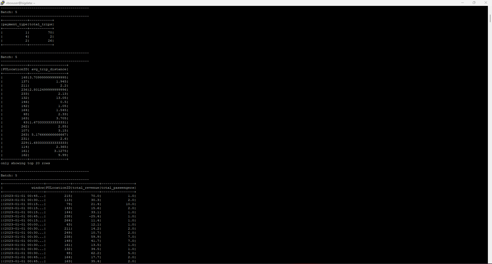

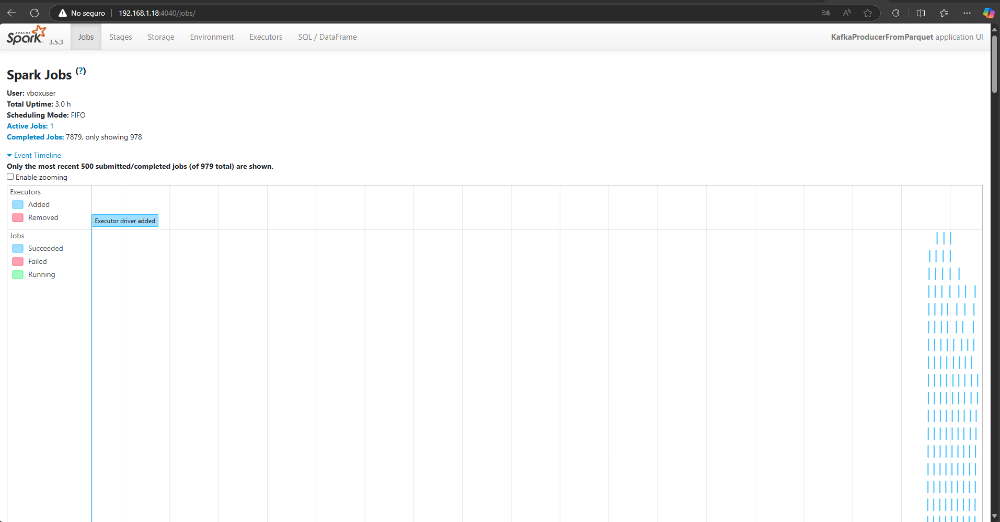

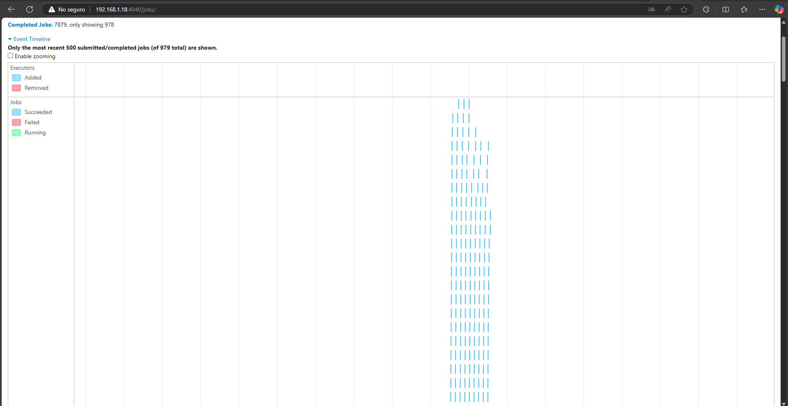


---

Descargar los archivos con el script de Python y guardarlos en HDFS:

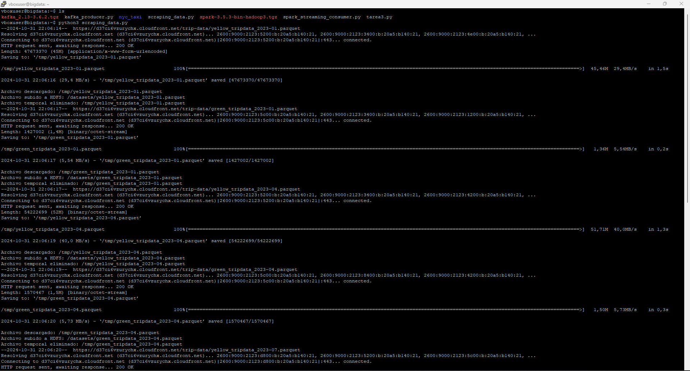
